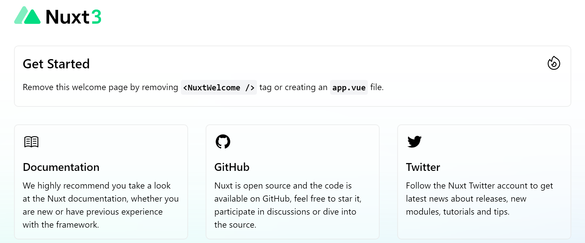
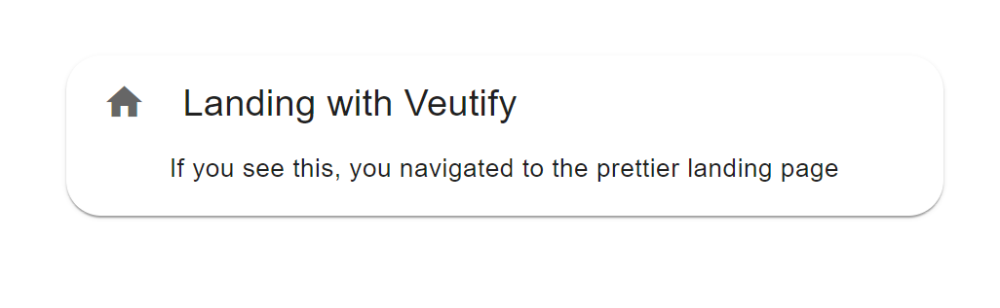

# Nuxt 3 and Vuejs - the Canvas for Building your Event's App 

 <!-- title: Nuxt 3 and Vuejs - the Canvas for Building your Event's App  -->


<!-- @import "[TOC]" {cmd="toc" depthFrom=1 depthTo=6 orderedList=false} -->
- [Nuxt 3 and Vuejs - the Canvas for Building your Event's App](#nuxt-3-and-vuejs---the-canvas-for-building-your-events-app)
- [Initiatlize your Project](#initiatlize-your-project)
- [Generate the content](#generate-the-content)
  - [Project Structure](#project-structure)
  - [Make it Beautiful](#make-it-beautiful)
  - [Land some Attendees](#land-some-attendees)
- [Build and Deploy](#build-and-deploy)
- [GitActions for Automations](#gitactions-for-automations)
- [Conclusion](#conclusion)
  - [References](#references)
  - [Github](#github)

NuxtJs is the defacto VueJs framework you would use to build your apps, these being Single Page App (SPA), Server-side Rendering (SSR), or Static-Site Generating (SSG). It's the latter that we will use to create an application for our event - an Agile Development Lego®s Workshop.

Why Nuxt and a Static app? 

Nuxt simplifies and structures your projects, paving the path to enterprise-ready architecture with various CLIs and tools to boot. 
We choose a Static app, because we want a Universal Application, which is discoverable and optimized for various search engines, plus the usecase here is simple with no external content to load or manipulate.

The Nuxt shown here, is part of the release candidate 3, which is a major upgrade of the Nuxt used in the industry and wa released with VueJs' major update to version 3.

# Initiatlize your Project

For this project I will use *yarn* instead of *npm* to manage dependencies and build the app.

To setup a project, nuxt offers a simple command to run within your node environment:

`npx nuxi init app`

Go to the *app* directory, and install all packages with using an  *yarn install*. Once this is done, run an *yarn dev* and navigate to *http://localhost:3000/* in your browser.



Since out of the box, nuxt3 comes with typescript, we should leverage the typing benefits by adding the required liraries and configuring type checkings. 
Add the libraries with:

`yarn add -D vue-tsc typescript`

Go to *nuxt.config.ts* in the app directory and enable automatic typechecking:

```ts
export default defineNuxtConfig({
  typescript: {
   typeCheck: true,
 },
})
```

run the eslint command `npx eslint --init` and go through the options to select vue and typescript to generate the correct eslint configuration file.
For nuxt3, this is how our *.eslintrc.yaml* is configured:

```yml
env:
  browser: true
  es2021: true
extends:
  - plugin:vue/base
  - plugin:vue/vue3-recommended
  - plugin:@typescript-eslint/recommended
  - '@nuxtjs/eslint-config-typescript'
parser: 'vue-eslint-parser'
parserOptions:
  parser: "@typescript-eslint/parser"
  ecmaVersion: latest
  ecmaFeatures: 
    jsx: true
  sourceType: module
plugins:
  - vue
  - '@typescript-eslint'
```

Don't forget to add the **--fix** to the linting command created in your package.json.

# Generate the content

## Project Structure

Let's plan our event app. We know we want a landing page, a registration page with sends these somewhere and an articles page, so that our organizers can generate content to be displayed.
Breaking it down in a Nuxt structure, this is what we plan:

- | *static*/: robots.txt and favicon.ico.
- | *plugins*/: Additional libraries, in our case we will add Vuetify.
- | *assets*/: Images and CSS we will deploy to the users.
- | *pages*/: Pages we will deploy. Nuxt will automatically import anything here.
  - | *index.vue*: Landing page.
  - | *register.vue*: How to register.
- | *content*/: Any additional articles or blogs the organizers want to show.

Let's start with a simple index page, to verify this setup works. Create an *index.vue* in *pages* and put in this simple vue component:

```tsx
<template>
  <div>
    <h1>Landing</h1>
    <p>If you see this, you navigated to the landing page.</p>
  </div>
</template>
```

In the *app.vue*, replace the default Nuxt3 *NuxtWelcome* component with the directive to navigate to the home page:

```tsx
<template>
  <div>
    <NuxtPage />
  </div>
</template>
```

Running the *yarn dev* should load a server pointing to the index page we just created.

## Make it Beautiful

Our app should be pretty, and what better way to do this than to add a *Vuetify* template:

```bash
yarn add vuetify@next sass @mdi/font
yarn add  -D vuetify@next vite-plugin-vuetify @fortawesome/fontawesome-free 
```

In the plugin directory, we need to add *vuetify.ts* for the veutify configurations:
```tsx
import '@mdi/font/css/materialdesignicons.css'
import { createVuetify } from 'vuetify'
import * as components from 'vuetify/components'
import * as directives from 'vuetify/directives'

export default defineNuxtPlugin((nuxtApp) => {
  const vuetify = createVuetify({
    components,
    directives
  })

  nuxtApp.vueApp.use(vuetify)
})

```

Extend *nuxt.config.ts* to include vuetify:

```ts
export default defineNuxtConfig({
  ...
  css: ['mdi/css/materialdesignicons.min.css', 'vuetify/lib/styles/main.sass'],
  build: {
    transpile: ['vuetify']
  },
  vite: {
    define: {
      'process.env.DEBUG': false
    }
  }
})
```

Let's make our index page beautiful:

```tsx
<template>
  <div class="pt-8 mt-4">
    <v-card
      class="mx-auto rounded-xl"
      width="600"
      prepend-icon="mdi-home"
    >
      <template v-slot:title>
        Landing with Veutify
      </template>
      <v-card-text class="text-center">
        If you see this, you navigated to the prettier landing page
      </v-card-text>
    </v-card>
  </div>
</template>
```



## Land some Attendees


# Build and Deploy

We will build a Static site generation (SSG), which means it prerenders every route of our app so navigation happens organically through html pages. Nuxt does this with a crawler to generate each HTML file. Add these configurations to the **nuxt.config.ts** to hint that we want a full static, not and preview version - which would have fetch API calls to each static page:

```ts
export default defineNuxtConfig({
  ...
  target: 'static', // This will make us full static, without api calls asyncData and fetch.
  ssr: false
})
```

# GitActions for Automations

# Conclusion


## References

- https://nuxtjs.org/
- https://vuejs.org/
- https://content.nuxtjs.org/
- https://next.vuetifyjs.com/en/getting-started/installation/


## Github

Code in this article is available on [Github](https://github.com/adamd1985/legoworkshop-guidelines).

#

<div align="right">Made with :heartpulse: by <b>Adam</b></div>